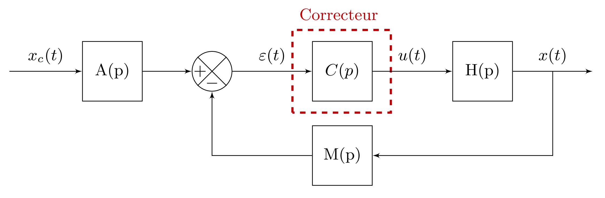
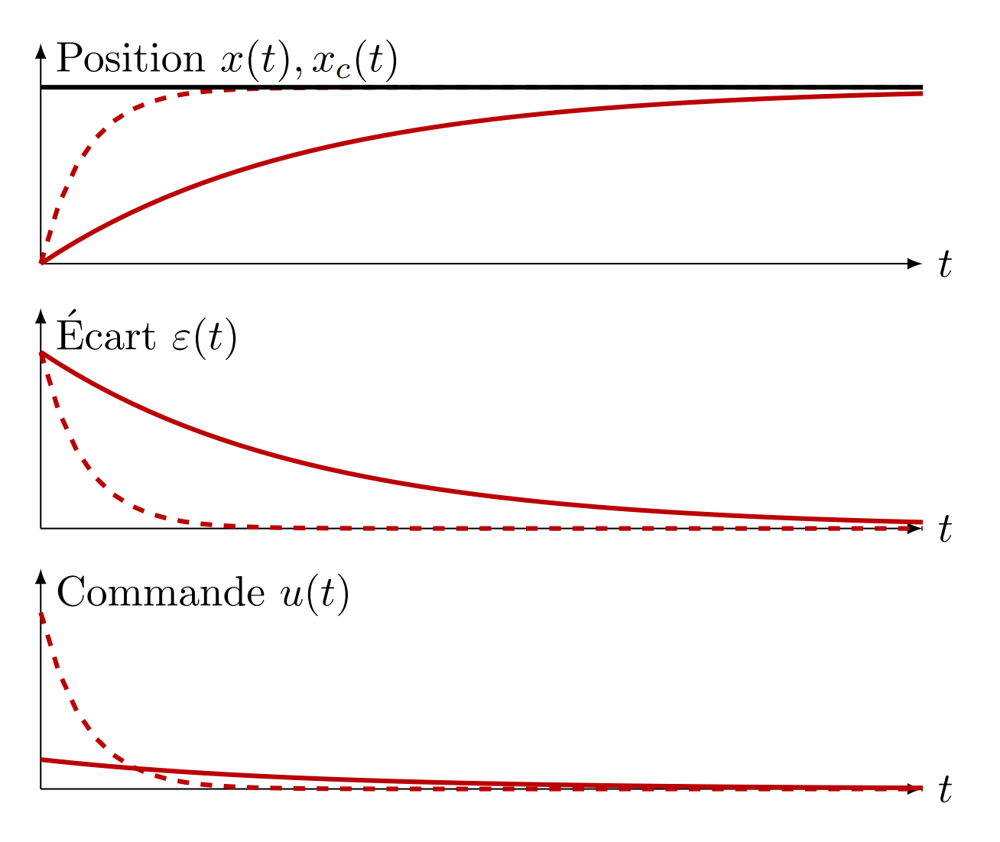
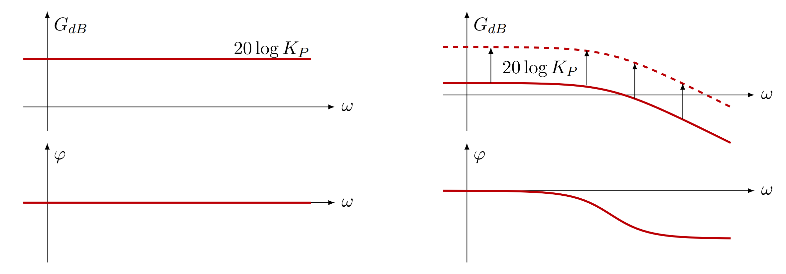
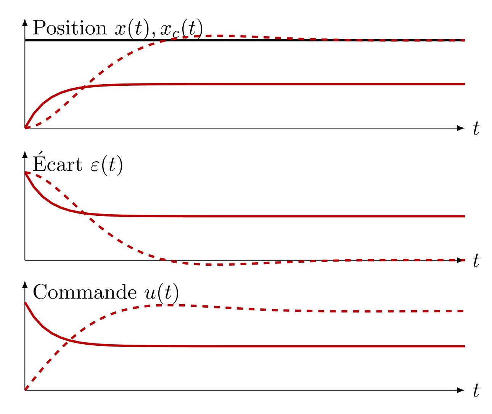
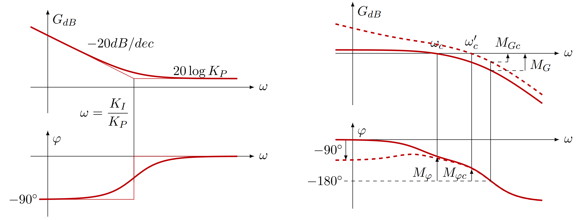
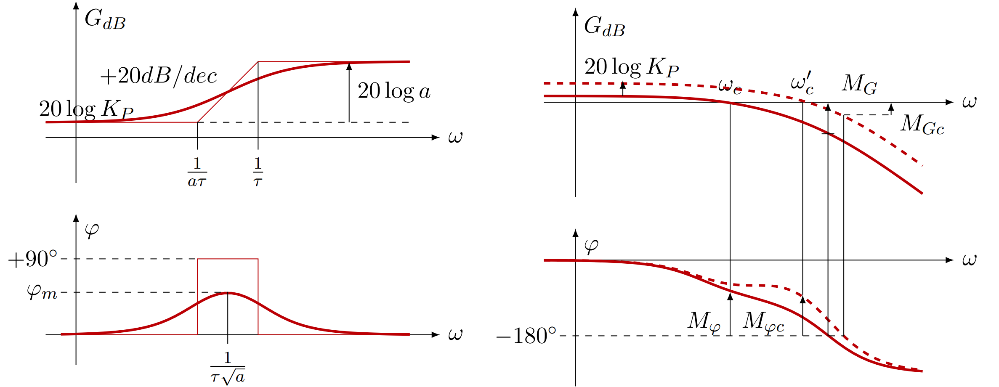
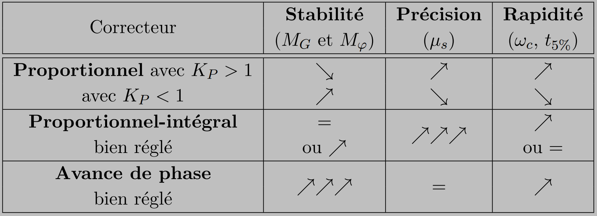

Lien [PDF](./SLCI.pdf).
# Les correcteurs

## Correcteur proportionnel : corriger la rapidité

Effet d'un correcteur proportionnel (système non corrigé en trait plein, système corrigé en pointillés).

$$C(p) = K_P$$

 Diagramme de Bode d'un correcteur proportionnel et effet sur une FTBO.

## Correcteur proportionnel intégral PI : corriger la précision

 Effet d'un correcteur PI (système non corrigé en trait plein, système corrigé en pointillés).

$$C(p) = K_P + \frac{K_I}{p} = \frac{K_P\ p + K_I}{p} = K_P \left(\frac{1+T_I\ p}{T_I\ p}\right)$$
où $K_P$ et $T_I = \dfrac{K_P}{K_I}$ sont deux coefficients réels nommés respectivement gain du correcteur et constante de temps du correcteur.

Ce correcteur amplifie les basse fréquences, ce qui améliore la stabilité.

 Diagramme de Bode d'un PI et effet sur une FTBO.

## Correcteur à avance de phase

$\displaystyle C(p) = K_P \frac{1+a\tau p}{1+\tau p}$ avec $a > 1$, où $K_P$ et $\tau$ sont des coefficients réels nommées gain du correcteur et constante de temps du correcteur. Ce correcteur ne modifie la phase qu'autour de la pulsation $\omega = \dfrac{1}{\tau \sqrt{a}}$ en laquelle elle atteint un maximum en $\varphi_m = \arcsin\left(\dfrac{a-1}{a+1}\right)$.

 Diagramme de Bode d'un correcteur à avance de phase et effet sur une FTBO.

## Tableau récapitulatif

