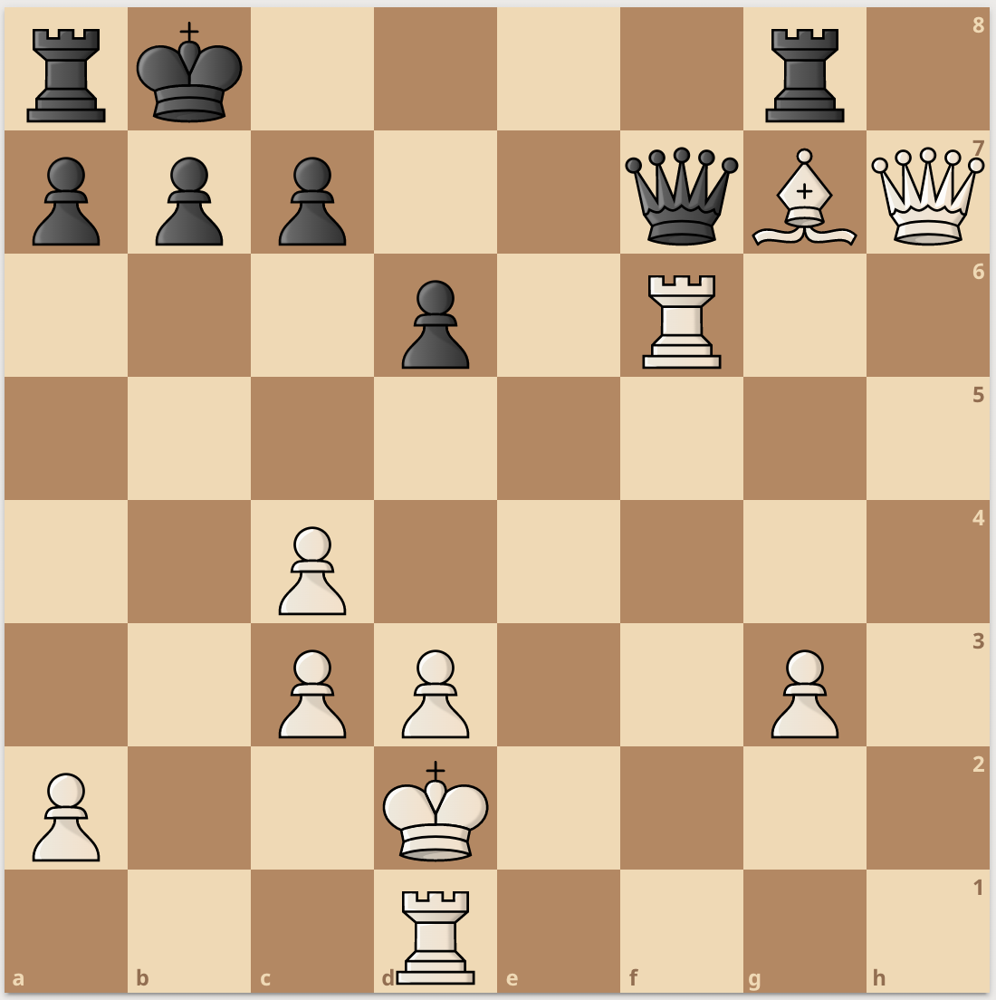
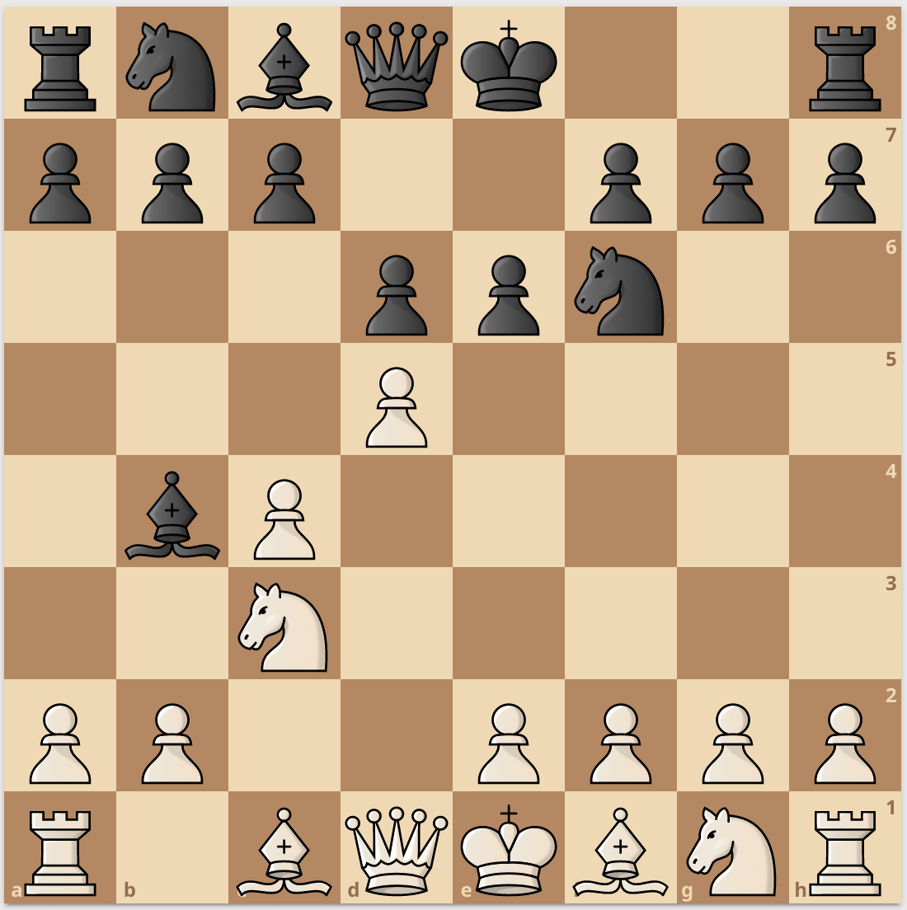
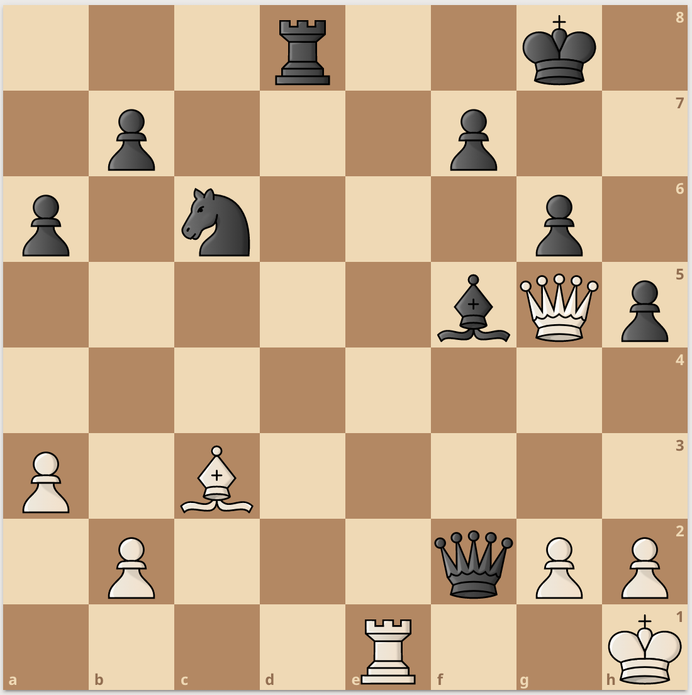
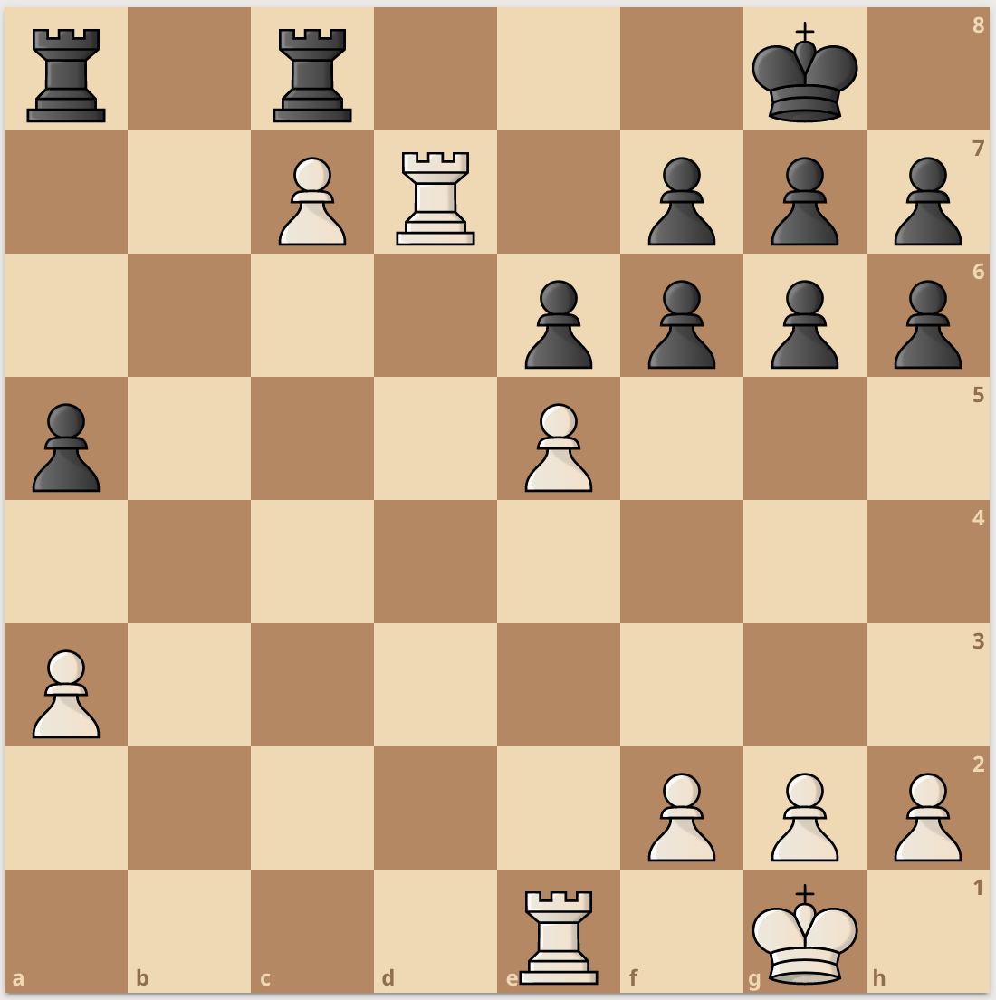

# Tactical Quiescence Search (TQS)

A tactical quiescence search (TQS) is a [quiescence search algorithm](https://www.chessprogramming.org/Quiescence_Search) with more [extensions](https://www.chessprogramming.org/Extensions). The engine finds [tactics](https://www.chessprogramming.org/Tactics) beyond the scope of [capture-only moves](https://www.chessprogramming.org/Captures).

## The idea

[Quiescence Search algorithm](https://www.chessprogramming.org/Quiescence_Search) (QS) is used to ensure the engine analyses only quiet positions, to favor it finds a [tactical moves](https://www.chessprogramming.org/Tactical_Moves). [Tactics](https://www.chessprogramming.org/Tactics) in QS are mostly based on [cature-only moves](https://www.chessprogramming.org/Captures) and sometimes on [checking moves](https://www.chessprogramming.org/Check).

TQS brings more to the table by considering other non-[quiet moves](https://www.chessprogramming.org/Quiet_Moves), like check-evader moves and [promotions](https://www.chessprogramming.org/Promotions).
Non-quiet moves are the essence of tactical play, thus scrolling through them helps making better tactical decisions.
In the [example](#Examples) section, the TQS remarquably finds several type of tactics. In the [limiting factorssection](#pro--con), the pros and cons of the TQS are (further) discussed.
## Pseudo Code

Here is a pseudo C code for the TQS algorithm, where ```check_depth``` is the maximum amount of [check extension](https://www.chessprogramming.org/Check_Extensions) in a given line of quiescence search, and ```quiesce_moves()``` is a generator of all the differents quiescent moves mentionned above (captures, checks, promotions, check-evaders) :

```C
// Tactical Quiescence Search (TQS)
int TQS(int alpha, int beta, int check_depth=10) { // check_depth could be changed

    stand_pat = evaluate();
    moves = quiesce_moves();

    // enf of line
    if (no move in moves) { 
        legals = legals_moves();
        if (no move in legals) { 
            if is_checkmate() {
                return -mateValue + nodeHeight; // for mate distance pruning
            }
            return 0; // it is a draw
        }
    }

    // mate distance pruning
    // upper bound
    mating_value = mateValue - nodeHeight;
    if (mating_value <= beta) {
        beta = mating_value;
        if (alpha >= mating_value) {
            return mating_value;
        }
    }
    // lower bound
    mating_value = mating_value = -mateValue + nodeHeight;
    if (mating_value >= alpha) {
        alpha = mating_value;
        if (beta <= mating_value) {
            return mating_value;
        }
    }

    // normal QSearch stuff
    if  (stand_pat >= beta) { // beta cutoff
        return beta;
    }
    if (alpha < stand_pat) {
        alpha = stand_pat;
    }

    for (move in moves) { // move is defined above
        
        // check extension : checking moves
        if !( is_capture(move)) && gives_check(move) { // capture moves giving check could be treated normally

            // extension limite reached
            if (check_extension <= 0) {
                continue;
            }

            // extension search
            make(move);
            score = -TQS(-beta, -alpha, check_depth-1);
            unmake(move);

            if (score >= beta) { // beta cutoff
                return beta;
            }
            if (score > alpha) {
                alpha = score;
            } 

            continue; // to avoid else statement on no-checking move
        }

        make(move);
        score = -TQS(-beta, -alpha, check_depth);
        unmake(move);

        if (score >= beta) { // beta cutoff
            return beta;
        }
        if (score > alpha) {
            alpha = score;
        } 
    }

    return alpha;
}
```

If ```quiesce_moves()``` does not generates checks-evaders, the following addition is possible (after end of the game checking) :

```C    
        // almost in the code
        if (no move in legals) { 
            if is_checkmate() {
                return -mateValue + nodeHeight; // for mate distance pruning
            }
            return 0; // it is a draw
        }

        // check extension (tactical) : check-evaders moves
        if is_check() {

            for (move in legals) {
                make(move);
                score = -TQS(-beta, -alpha, check_depth);
                unmake(move);

                if (score >= beta) { // beta cutoff
                    return beta;
                }
                if (score > alpha) {
                    alpha = score;
                } 
            return alpha;
            }
        }
```

Notice that this piece of code (concerning [beta-cutoff](https://www.chessprogramming.org/Beta-Cutoff)) appears several times in the code, so the code could probably be optimised :
```C
if (score >= beta) { // beta cutoff
    return beta;
}
if (score > alpha) {
    alpha = score;
} 
```

## Examples

In this section, the following position has been considered to compare classic QS and TQS.

### Check-extensions
<a href="https://lichess.org/analysis/standard/rk4r1/ppp2qBQ/3p1R2/8/2P5/2PP2P1/P2K4/3R4_b_-_-_0_1"></a>\
Black to play. FEN : ```rk4r1/ppp2qBQ/3p1R2/8/2P5/2PP2P1/P2K4/3R4 b - - 0 1```

Here, the best move is ```1... Qe8```.\
But a classical quiescence search with no check-extension will find ```1... Qxg7``` as the best move, because ```2. Qxg7 Rxg7``` wins the bishop. But without check extension, the QS is oblivious to 3. Rd8#.\
In this case, TQS finds ```1... Qe8``` as the best move.


### Check evasions
<a href="https://lichess.org/analysis/fromPosition/rnbqk2r/ppp2ppp/3ppn2/3P4/1bP5/2N5/PP2PPPP/R1BQKBNR_w_KQkq_-_0_1"></a>\
White to play. FEN : ```rnbqk2r/ppp2ppp/3ppn2/3P4/1bP5/2N5/PP2PPPP/R1BQKBNR w KQkq - 0 1```

Here, the best move is ```1. Qa6+```.\
A classical QS + check-extensions can see that move, but as it gives check and there is not any possible captures or checking moves after ```1. Qa6+```, QS will ask an [evaluation](https://www.chessprogramming.org/Evaluation). Unless [SEE](https://www.chessprogramming.org/Static_Exchange_Evaluation) is implemented in evaluation, QS will not see why this move is so good, taking the bishop in b4.\
However, TQS will see all possible tactical lines after ```1. Qa6+``` and will see that White is winning a bishop (or a knight after ```1... Nc6```).

### Check-extensions + Check evasions
<a href="https://lichess.org/analysis/fromPosition/3r2k1/1p3p2/p1n3p1/5bQp/8/P1B5/1P3qPP/4R2K_w_-_-_0_1"></a>\
White to play. FEN : ```3r2k1/1p3p2/p1n3p1/5bQp/8/P1B5/1P3qPP/4R2K w - - 0 1```

Here, the right sequence is ```1. Qxd8+  Nxd8 2. Re8+ Kh7 3. Rh8#```.\
With a classical approach, QS will not search with captures-only QS, after ```1. Qxd8+  Nxd8``` White loses the queen.\
As each move gives or responds to a check, TQS finds the best sequence.

### Promotions
<a href="https://lichess.org/analysis/standard/r1r3k1/2PR1ppp/4pppp/p3P3/8/P7/5PPP/4R1K1_w_-_-_0_1"></a>\
White to play. FEN : ```r1r3k1/2PR1ppp/4pppp/p3P3/8/P7/5PPP/4R1K1 w - - 0 1```

Here, the correct answer is ```1. Red1```, preparing ```2. Rd8+ Rxd8 3. Rxd8+ Rxd8 4. exd8=Q#```. However, Black plays ```1... Re8``` to prevent mate, but after ```2. Rd8 Kf8 3. Rxa8 Rxa8 4. Rd8+ Ke7 5. Rxa8``` and the promotion ```6. c8=8``` is unavoidable. Then in this position White can safely promote the c pawn.\
However a classical QS (even with check-extensions + check evasions) would never see the promotion and abort this line.\
Here, even TQS can't find the best line, but {search depth 4 + TQS} can find it while {search depth 4 + QS} won't, due to pawn promotion (depth 4 is where the first capture occurs).

## Pros / Cons

### Advantages of TQS

- As described in the [examples section](#examples), TQS can find tactics that a classic QS won't.
- The [score](www.chessprogramming.org/Score) of a position is more accurately determined with TQS.
- For low [depth](https://www.chessprogramming.org/Depth) searches, TQS is essential.
- TQS becomes really good with a fast [move generator](https://www.chessprogramming.org/Move_Generation).

### Disadvantages of TQS

- TQS explores more [nodes](https://www.chessprogramming.org/Node) than a classical QS.
- TQS is slower than a classical QS.
