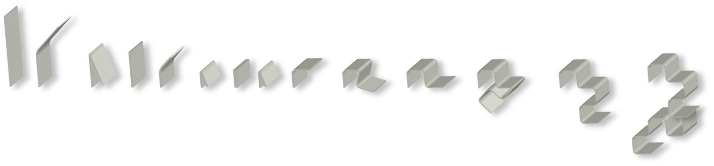
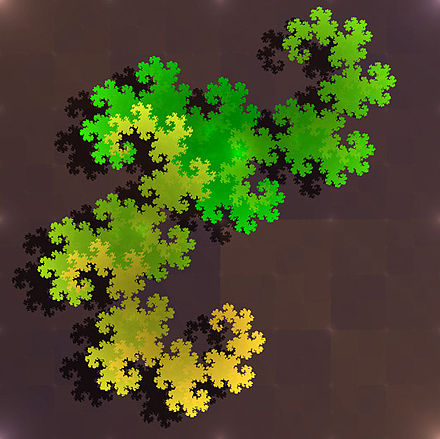
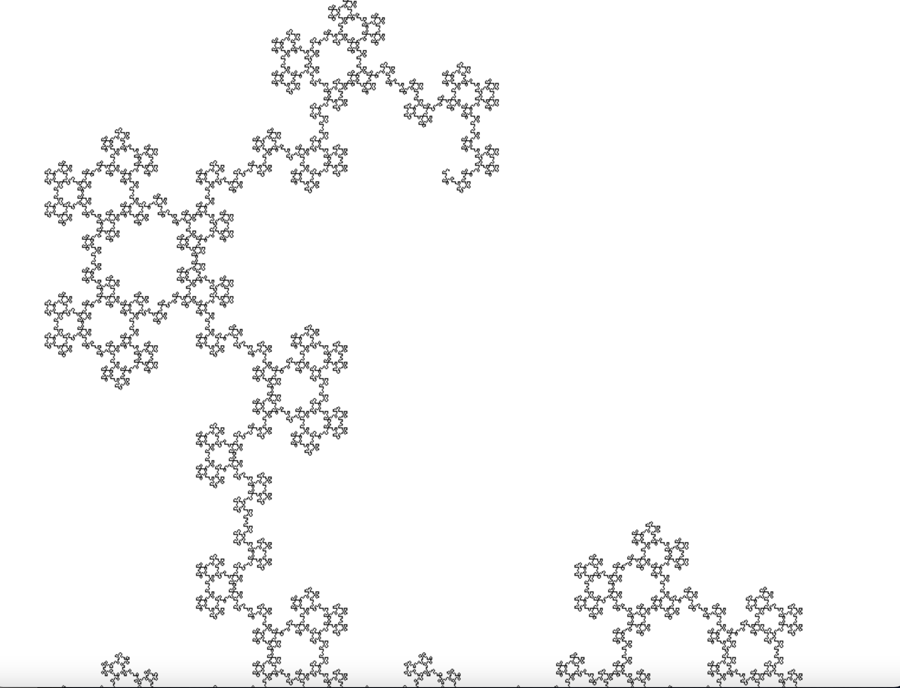

# Pliage de fractales
Un algorithme pour plier la courbe du dragon est bien connu : [en voici la page Wikipédia](https://fr.wikipedia.org/wiki/Suite_de_pliage_de_papier). Il consiste à plier en deux une longue bandelette de papier en deux, puis en deux et encore en deux et ainsi de suite à l'infini. On déplie ensuite tous les plis à 90° comme sur la figure du processus suivante :\
\
On obtient alors la courbe suivante :



Mais l'on divise à chaque fois la feuille en deux. On peut alors se demander ce qui se passerait si l'on divisait pas exemple la feuille en trois. Plutôt que de plier à l'infini une feuille (les plieurs les plus motivés pourront s'y attarder s'ils le souhaitent), on s'intéressera ici à la programmation d'un algorithme le faisant pour nous.

## Algorithme

```
On a la feuille (pas encore pliée) suivante :

''

On veut la plier selon le procédé précédemment expliqué. On note V les plis
vallées et M les plis montagnes.

iter 1 :  'V'                On ajoute un plis vallée au milieu
iter 2 :  'VVM'              On plie encore : sur la couche du dessus, le pli
                             est en vallée. Mais sur la couche du dessous, le
                             pli vallée s'inverse à cause du premier pli vallée
                             déjà présent, et donc passe en montagne.
iter 3 :  'VVMVVMM'          Même principe.
iter 4 :  ''VVMVVMMVVVMMVMM' Pareil.
```

## Code en Python
Voici, en Python (un langage de programmation), le code de cet algorithme :

``` Python
def plier(feuille: str, iteration: int, nb_plis: int) -> str :

    # Lorsque aucun pli ne doit être fait, on retourne un mot vide.
    if iteration == 0 :
        return ''
    
    folded_feuille = '' # On part d'une feuille à plier, qui sera la feuille
                        # finale
    pli = 'V' # On commence par des plis vallées (à différencier des plis
              # montagnes, en crête et donc dans l'autre sens.)

    # On va, pour cette itération, se baser sur l'itération précedente.
    feuille = plier(feuille, iteration-1, nb_plis)

    ######################
    # Ici commence l'algorithme de pliage
    ######################
    # Pour chaque pli de la feuille :
    for Pli in feuille :
        folded_feuille += pli * nb_plis + Pli # On ajoute le nombre de plis
                                              # entre chaque pli de l'itération
                                              # précédente
        # Puis on chage le type de pli
        if pli == 'V' :
            pli = 'M'
        else : 
            pli = 'V'
    folded_feuille += pli * nb_plis # On n'oublie pas d'ajouter des plis à la
                                    # fin de la bande

    return folded_feuille
```

## Affichage :
Avec un code supplémentaire pour transformer notre "mot" de plis en affichage ([code disponnible ici](./render.py)), on obtient, pour 13 itérations, la figure suivante :


On est alors en mesure de répondre à la question posée au dévut : que se passe-t-il si l'on plie la feuille en trois à chaque fois ? Ici avec 10 itérations :


<br><br><br><br><br><br><br><br><br><br><br>


Crédits images : Wikipédia et Paul JF

Article : Paul JF
